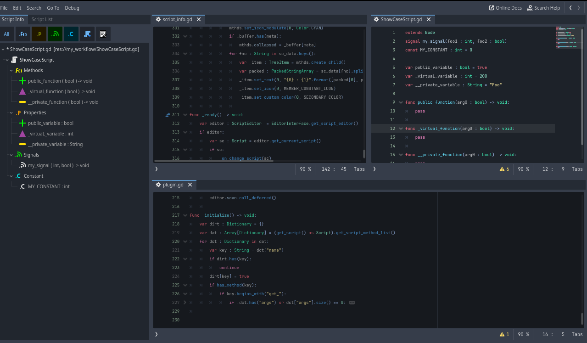
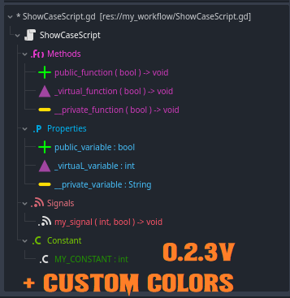

# Godot-IDE
Godot IDE Extension

 

This addon extends Godot's native code editor with additioinal functionality and usability.

## Table of contents

- [Preview](#preview)
- [Features](#features)
- [Objectives](#objetives)
- [How to Use](#how-to-use)
- [How to Contribute](#how-to-contribute)
- [FAQ](#faq)
- [Special Thanks](#special-thanks-)

## Objetives
The goal of this project is to provide Godot with some additional features to improve the development experience without adding any extra overhead.

## Preview

## Features
Each feature is described more fully in it's own repository, as well as down below.

* Multi Split Container:
	https://github.com/CodeNameTwister/Multi-Split-Container
* Script Spliter:
	https://github.com/CodeNameTwister/Script-Spliter
* Quick Folds:
	https://github.com/CodeNameTwister/Quick-Folds
* GD Override Functions:
	https://github.com/CodeNameTwister/GD-Override-Functions
* The following plugins are integrated with this addon, they are not published as a separate plugin.
	* Fancy Filters Script: 
	* Fancy Search Files
	* Fancy Search Class
 	* Macro-N

* [Documentation](https://github.com/CodeNameTwister/Godot-IDE/blob/main/DOCUMENTATION.md)

## How to use

* Script Spliter:
	* Use `Ctrl + num` to change the type of split. (Requires more than 1 script open)
  	* You can create/remove a split with the right mouse button context menu. (Depends on the number of opened scripts)
  	* You can also add popout windows from the same context menu

* Quick Folds:
	* Use `Alt + num` to fold all lines of the specified indent. e.g. `Alt + 1` folds everything, `Alt + 2` folds only second-level indented blocks.
	* Hold `Shift` at the same time to show folded lines. e.g. `Shift + Alt + 1` unfolds all code.

* GD Override Functions
	* From the right mouse button context menu the Override Virtual Functions can be opened.
	* This allows you to automatically generate override methods for virtual funcions in parent classes.
	* Use `Alt + insert` to open the override functions window.

* Fancy Search Files
	* Use `Ctrl + Alt + Space` to open the file search window where you can easily search all files in your project by type, name, etc.

* Fancy Search Class Files
	* Use `Alt + Delete` to open the class & script search window where you can easily view where individual classes and scripts are being used in your project.

* Fancy Filters Script
	* In the script editor two new tabs have been added to the left panel: Settings and Script Info. The Script Info tab gives you an overview of the current script and also allows you to view the properties of all classes which the current script inherits from. The Settings tab lets you configure the Script Info tab to your liking.
 	* Use `Ctrl + T` for show/hide the panel.
  	* Use `Ctrl + G` to switch between **script info** and the **script list** panels.
* Macro-N
	* Create Macro with `Context Menu (RMB)` (Show only to create Macro-N if you have text selected)
	* With selected text use `Ctrl+E` for Invoke Macro.
	* With selected text use `Ctrl+SHIFT+E` for Invoke Macro with bypass.
 	* Show all saved Macros with `Alt+INSERT`shortcut.

* Editor Settings
	* In Editor Settings (with Advanced option enabled) you can change any option of this plugin in `plugin/godot_ide` or neighbors plugins of Godot-IDE.
 	* All plugins have their configuration parameters defined in that section, even for inputs.
## How to contribute

### Submit issues
Report any bugs you find in the [Issues](https://github.com/CodeNameTwister/Godot-IDE/issues) tab, as well as any feature requests you may have. Influence the future of this plugin!

### Submit pull requests
If you'd like to help out with development don't hesitate to submit a pull request!

### Integrate with this plugin
To add a plugin that works alongside Godot-IDE, simply create a plugin as you normally would and add it to the `_Godot-IDE_/plugins` folder.

>[!TIP]
> Additional scripts must also be enabled in the `plugin.cfg` file.

## FAQ
* Why is the folder called `_Godot-IDE_`?
	* This is due to the way addons are loaded in Godot, which is alphabetical. This naming gives priority to this addon, avoiding any incompatibility for other plugins.

## TODO 
* Add documentation.

## Special Thanks 📜
This section lists users who have contributed to improving the quality of this project.

- [@kyrosle](https://github.com/kyrosle)
- [@nathan-coleman](https://github.com/nathan-coleman)
- [@sam-online](https://github.com/sam-online)

##
> I hope this is helpful. Personally, I've decided to do everything in gdscript for compatibility reasons, but I might create a C++ extension if a future feature requires it, as in cases I've had for generations or using recursive functions that still offer poor performance.
>
> Now use it, modify it, break it, fix it, and improve it to your liking.

Twister

##
Copyrights (c) CodeNameTwister. See [LICENSE](LICENSE) for details.

[godot engine]: https://godotengine.org/
